<h1 align="center"> Zod Admin </h1>
<p align="center">一个基于 Zod 封装实现的快速后台管理系统</p>
<p align="center">
  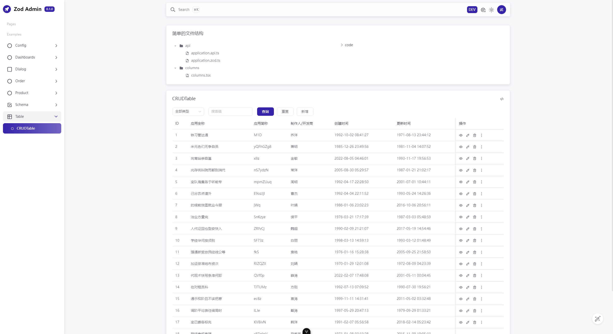
</p>

---

# 核心

- 核心实现流程，完整示例见：[Zod Admin 使用文档](https://peropero.feishu.cn/wiki/HoJowBjtmiBXQqkqM3Lcfidonsb#MuLVdlFwboSXHNxU8QjcqY4Bnkf)，仅需定义两个 api 文件，一个 column 文件，一个 table 文件即可实现一个 CRUD 表格
  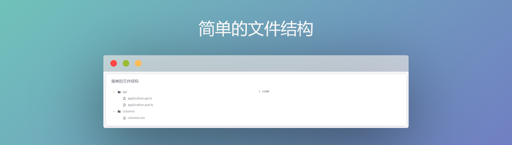

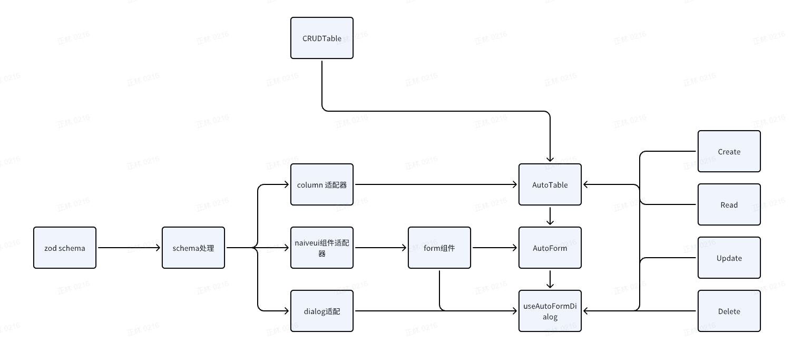

- zod admin 分为 `core` 和 `views` 以及配置文件三部分，其中 `src\core` 是 zod admin 的核心部分，它实现了如下的功能：
  - 涵盖了整体项目的框架
  - 实现了项目的账号密码登录，登录重定向，错误页面重定向，路由守卫
  - 实现了项目的用户信息模块
  - 实现了文件路由系统，菜单路由系统
  - 实现了依据 zod 的表单，表格，弹窗生成
  - 实现了主题色切换
  - 实现了实时环境切换，系统配置
  - 实现了基于 Apex Charts 的图表

## 主题

## 支持主题切换

- Light：
  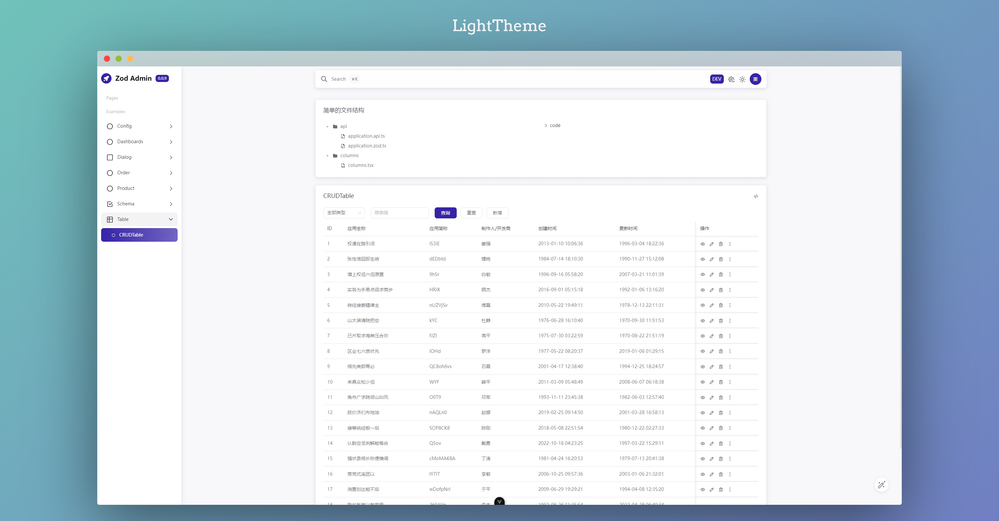
- Dark：
  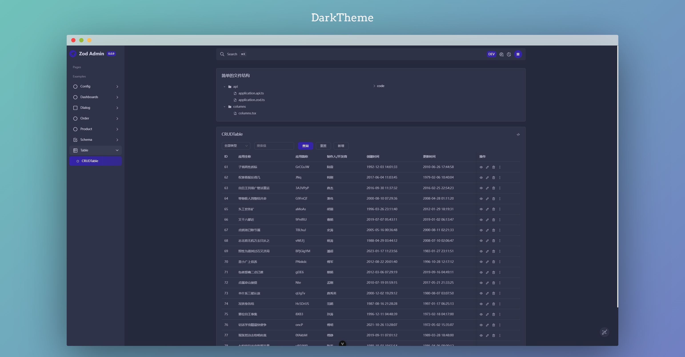

## 自动识别路由

zod admin 增加了自动识别路由功能，在 `src\views\Module\Admin\pages` 下，创建文件夹视为文件目录，在文件目录中创建文件视为视图路由；

```sql
- pages
    - Announcement
        - AnnounceMsg.vue
    - User
        - UserMsg.vue
```

注意

- 文件识别仅支持.vue 文件
- 仅支持一级目录

### 为自动路由添加名称、icon

自动路由目前是根据路由的名称来创建视图上的名称，但也提供了额外的选项支持用户自定义路由名称；

在 `zod-admin.config.ts` 中可以配置

参考：

```sql
routers: {
    User: {
      title: '用户管理',
      icon: 'tabler:user',
    },
    UserMsg: {
      title: '用户信息',
    },
    Announcement: {
      title: '公告管理',
      icon: 'tabler:article-filled-filled',
    },
    AnnounceMsg: {
      title: '公告信息',
    },
  },
```

注意

- key 值必须和原始路由名称相同
- icon 参考：[https://icones.js.org/collection/tabler](https://icones.js.org/collection/tabler)

## 配置环境

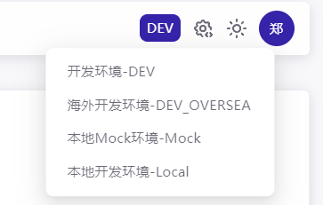

zod admin 支持环境配置，可以配置

- git 仓库地址
- 环境存储的 key(用于防止在本地启动同个继承自 zod admin 环境冲突)
- 环境配置

在 `zod-admin.config.ts` 中可以配置

参考：

```sql
env: {
    git: 'https://git.peropero.net/web/zod admin',
    storageKey: 'PR_RUSH_ADMIN_BASE_URL',
    option: [
      {
        i18n: {
          cn: '开发环境',
          en: 'DEV',
        },
        key: import.meta.env.VITE_APP_ADMIN_DEV,
      },
      {
        i18n: {
          cn: '海外开发环境',
          en: 'DEV_OVERSEA',
        },
        key: import.meta.env.VITE_APP_ADMIN_DEV_OVERSEA,
      },
      {
        i18n: {
          cn: '测试环境',
          en: 'TEST',
        },
        key: import.meta.env.VITE_APP_ADMIN_TEST,
      },
      {
        i18n: {
          cn: '海外测试环境',
          en: 'TEST_OVERSEA',
        },
        key: import.meta.env.VITE_APP_ADMIN_TEST_OVERSEA,
      },
      {
        i18n: {
          cn: '生产环境',
          en: 'PROD',
        },
        key: import.meta.env.VITE_APP_ADMIN_PROD,
      },
      {
        i18n: {
          cn: '海外生产环境',
          en: 'PROD_OVERSEA',
        },
        key: import.meta.env.VITE_APP_ADMIN_PROD_OVERSEA,
      },
      {
        i18n: {
          cn: '本地Mock环境',
          en: 'Mock',
        },
        key: import.meta.env.VITE_APP_ADMIN_MOCK,
      },
    ],
  },
```

- 当 key 在环境变量中不存在时会自动过滤

### 本地环境配置

zod admin 同时支持无代码的本地项目环境配置，用户点击系统设置后可以进行本地环境 URL 的替换，用于后端快速调试且不修改前端代码


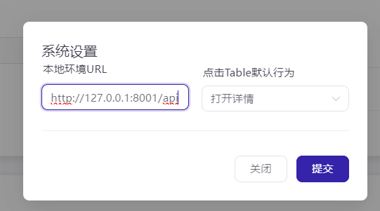

## 配置登录模块

zod admin 支持登录模块配置，目前仅支持账号密码登录；

在 `zod-admin.config.ts` 中可以配置

参考：

```typescript
login: {
    default: {
      url: 'http://47.113.106.234:8001/api/admin/admin_user/login',
      method: 'GET',
      schema: z.object({
        email: z.string().min(1),
        password: z.string().min(1),
      }),
      tokenKey: 'token',
    },
  },
```

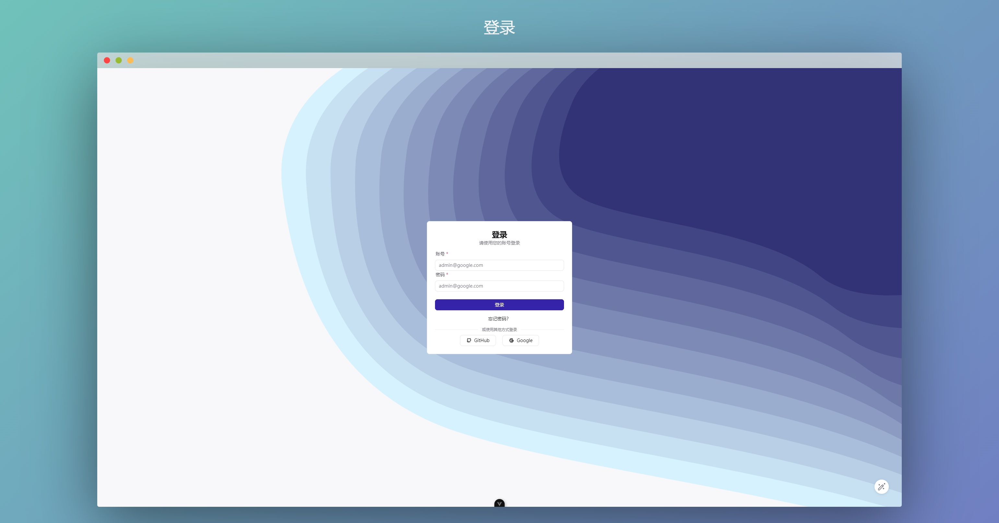

## 配置请求

zod admin 支持配置请求相关，可以配置 token 前缀，mock token

在 `zod-admin.config.ts` 中可以配置

参考：

```typescript
request: {
    token: {
      prefix: 'Bearer ',
      mock: '',
    },
  },
```

## 配置用户登录模块

zod admin 支持配置用户登录信息，可以配置用户名称，用户邮箱，用户头像

在 `zod-admin.config.ts` 中可以配置

参考：

```sql
user: {
    default: {
      url: '/mock/admin/user/info',
      method: 'GET',
      apiKeyAdapter: {
        nickName: 'nick_name',
        email: 'email',
      },
    },
  },
```

- 当不存在用户头像的时候，用户头像会以用户的第一个字符自动生成

## 网站信息

zod admin 支持配置网站相关主题信息

在 `zod-admin.config.ts` 中可以配置

参考：

```typescript
site: {
    title: 'lmc cms',
    logoName: 'LMC CMS',
    theme: {
      primaryColor: 'rgba(35, 92, 222, 1)',
    },
  },
```

## 系统配置

zod admin 支持进行一些无代码的系统配置，目前可以配置的行为有

- 本地环境 URL
- 点击 Table 的默认行为

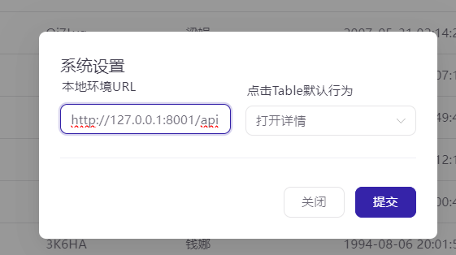

## Schema 组件

- 见：/examples/schema/schemas

1. 数据来源于外部的组件

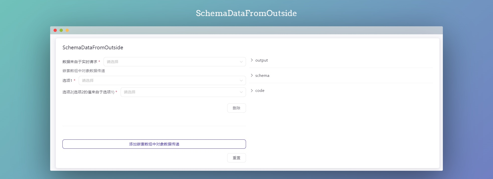

1. 常规组件

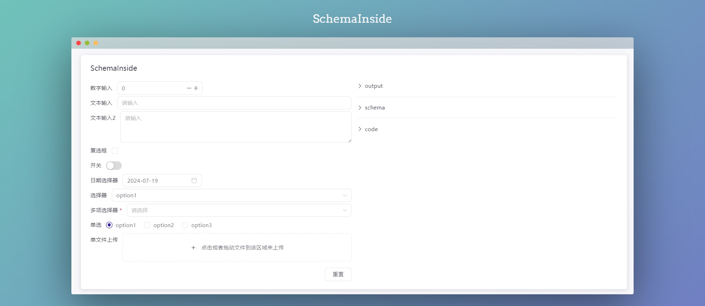

1. 组件配置

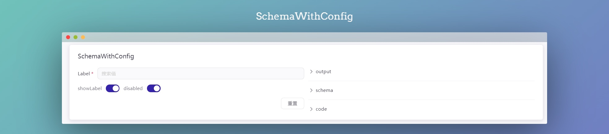

1. 枚举组件

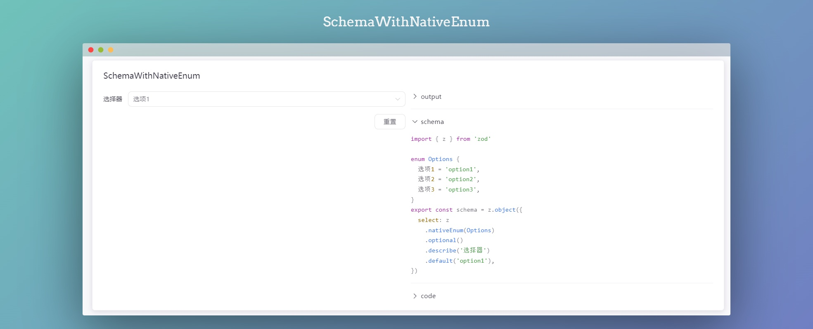

1. 对象嵌套组件


1. 数组对象嵌套组件

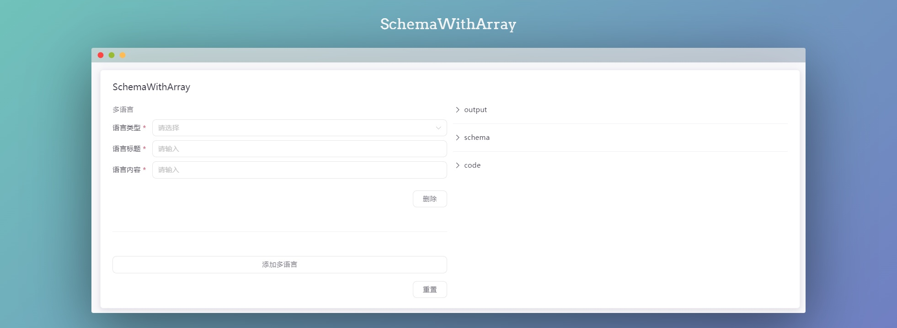

1. 文件上传组件

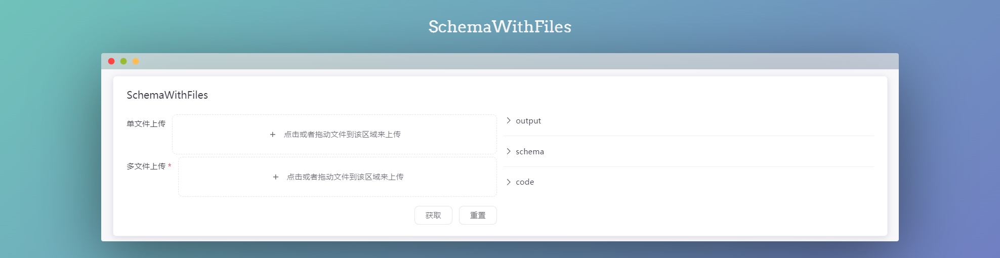

## Dialog

- 见：/examples/dialog/autoformdialog

1. AutoFormDialog

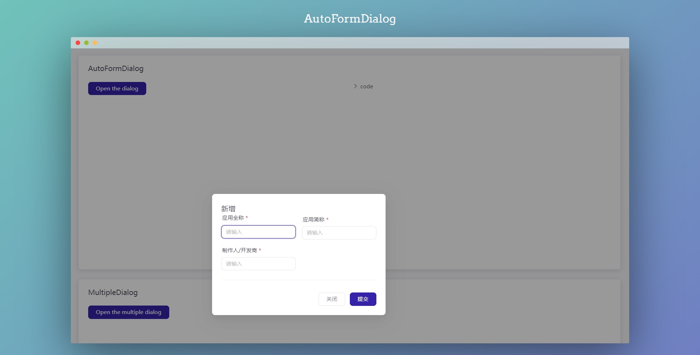

1. MultipleDialog

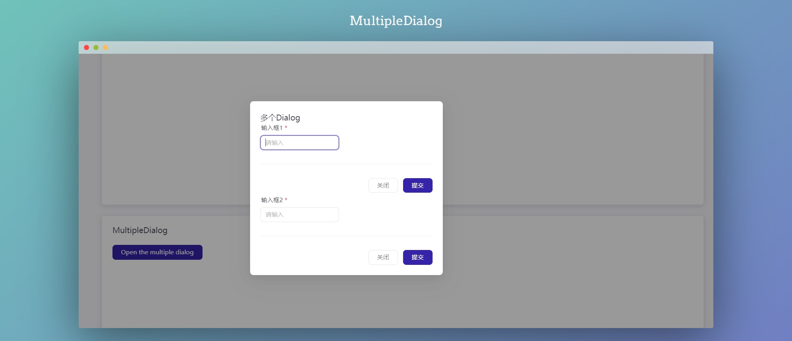

## Config

- 见：/examples/config/config

1. Config

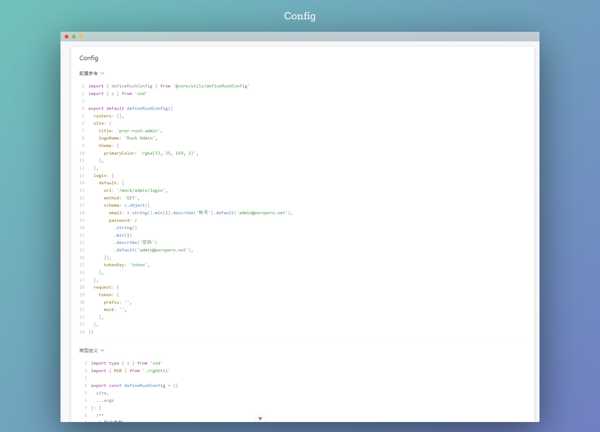

## Table

- 见：/examples/table/crudtable

1. CRUDTable

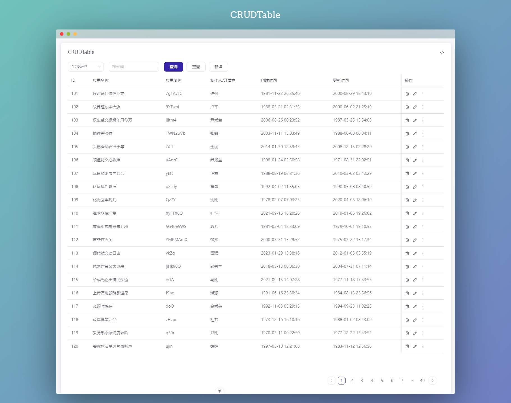

## Examples

- 所有的样例数据均已完成 mock
- 所有的样例不会出现在非开发环境

完整示例参考：

`src\core\examples`

- Api 参考

  - `src\core\examples\views\Table\api` 为 api 相关定义
  - `application.api.ts`
    - 集成了 axios 相关 httpClient，在此处定义接口 api
  - ~~applicationTableQuery.ts~~~~（已废弃，合并更新到 useRushTableV2 中）~~
    - ~~集成了 tanstackquery 相关 query 库，在此处定义自动请求 api(对于表格为查询用 api)~~
  - `application.zod.ts`
    - 集成了 zod 相关，在此处定义 api 相关 zod schema
  - ~~application.type.ts~~
    - 集成了 ts 相关，在此处定义 api 相关类型
- columns 参考

  - `src\core\examples\views\Table\columns`
    - 表格字段相关定义
    - 特殊操作（编辑，删除，查看）相关定义
- CRUDTable.vue 参考

  - `src\core\examples\views\Table\CRUDTable.vue`
    - 查询，重置，新增相关定义
    - 表格数据，表格分页相关定义

# Apis

## useRushTableV2

- 说明:获取表单的查询函数，重置函数，表单绑定值，分页 Props，AutoFormProps
- 类型定义：

```typescript
interface Transform<T extends GenericObject, K extends unknown> {
  transform: (v: T) => K
}
interface UseRushTable<
  T extends GenericObject,
  K extends GenericObject,
  U extends Record<keyof T, z.ZodTypeAny>,
> {
  /**
   * schema
   */
  schema: z.ZodObject<U>
  /**
   * api
   * @param args
   * @returns
   */
  api: (...args: T[]) => Promise<K>
  /**
   * api适配器
   */
  apiKeyAdapter: {
    params: {
      page: keyof T
      size: keyof T
    }
    data: {
      total: keyof K
    }
  }
  /**
   * form field配置
   */
  fieldConfig?: (
    values: UnwrapZod<T>
  ) => Partial<Record<keyof T, FieldConfigItem>>
}
type UseRushTableWithTransform<
  T extends GenericObject,
  K extends GenericObject,
  U extends Record<keyof T, z.ZodTypeAny>,
  E extends unknown,
> = UseRushTable<T, K, U> & Transform<K, E>

type UseRushTableWithPartialTransform<
  T extends GenericObject,
  K extends GenericObject,
  U extends Record<keyof T, z.ZodTypeAny>,
  E extends unknown,
> = UseRushTable<T, K, U> & Partial<Transform<K, E>>

type RushTableReturnType<
  T extends GenericObject,
  U extends Record<keyof T, z.ZodTypeAny>,
> = {
  /**
   * 搜索函数
   * @param e
   * @returns
   */
  onSearch: (e?: Event | undefined) => Promise<void | undefined>
  /**
   * 重置函数
   * @param state
   * @param opts
   * @returns
   */
  onReset: (
    state?: Partial<FormState<GenericObject>> | undefined,
    opts?: Partial<ResetFormOpts> | undefined
  ) => void
  /**
   * 分页Props
   */
  paginationProps: globalThis.ComputedRef<PaginationProps>
  /**
   * schema values
   */
  values: UnwrapZod<T>
  /**
   * AutoForm props
   */
  formProps: MaybeRefOrGetter<{
    schema: z.ZodObject<U>
    fieldConfig?: Partial<Record<keyof T, FieldConfigItem>>
  }>
}
```

## useRushTable（已废弃，合并到 useRushTableV2）

- 说明：获取表单的查询函数，重置函数，表单绑定值
- 类型定义：

```typescript
export const useRushTable = <T extends GenericObject>(option: {
  schema: z.ZodObject<Record<keyof T, z.ZodTypeAny>>
}) => {
   //
  return {
    onSearch,
    onReset,
    values: values as T,
  }
}
```

### createFormSearchQueryOption

- 说明：获取自动查询接口所需配置项
- 类型定义：

```typescript
export const createFormSearchQueryOption = () => {
    //
  return {
    placeholderData: keepPreviousData,
    enabled: () =>
      !isFormDirty.value || (isFormValid.value && isSubmitting.value),
  }
}
```

## useRushTablePagination(已废弃，合并到 useRushTableV2)

- 说明：获取分页参数
- 类型定义：

```typescript
export const useRushTablePagination = <T extends GenericObject>(option: {
  /**
   * schema中定义的page的键名称
   */
  page?: keyof T
  /**
   * schema中定义的pageSize的键名称
   */
  pageSize?: keyof T
  /**
   * 接口返回的分页总数
   */
  total: MaybeRefOrGetter<number>
  /**
   * 自动请求所需的refetch函数
   * @returns 
   */
  onRefetch: () => void
}) => {
    //
  return {
    /**
     * 分页所需props
     */
    paginationProps,
  }
}
```

## useRushColumns

- 说明：获取表格 columns
- 类型定义：

  - fieldConfig
    - render，可以通过 Helper 自定义

```typescript
type UnwrapZod<T extends Record<string, z.ZodTypeAny>> = z.infer<z.ZodObject<T>>
export const useRushColumns = <T extends Record<string, z.ZodTypeAny>>({
  /**
   * schema
   */
  schema,
  /**
   * autoform的fieldConfig
   */
  fieldConfig,
  /**
   * 自定义操作栏
   */
  suffix,
}: {
  schema: z.ZodObject<T>
  fieldConfig?: Partial<
    Record<
      keyof T,
      {
        render?: Helper<UnwrapZod<T>>
        colName?: string
        ignore?: boolean
      }
    >
  >
  suffix?: Helper<UnwrapZod<T>>
}) => {
  return columns as ColumnDef<UnwrapZod<T>, any>[]
}
```

### Helpers

- 说明：Column 的一系列渲染函数
- 类型定义：

```typescript
export type Helper<T extends any> = (
  props: CellContext<T, any | undefined>
) => any
```

#### EllipsisHelper

- 说明：带省略号的渲染函数
- 类型定义：

```typescript
export const EllipsisHelper = <T extends any>(
  props: CellContext<T, any | undefined>
) => <NEllipsis>{props.getValue()}</NEllipsis>
```

#### DateHelper

- 说明：格式化日期的渲染函数
- 类型定义：

```typescript
export const DateHelper = <T extends any>(
  props: CellContext<T, Date | undefined>
) => dayjs(props.getValue()).format('YYYY-MM-DD HH:mm:ss')
```

#### AvatarHelper

- 说明：用户头像的渲染函数
- 类型定义：

```typescript
export const AvatarHelper = ({
  avatar,
  name,
  description,
}: {
  /**
   * 用户头像url
   */
  avatar?: string
  /**
   * 用户名称
   */
  name?: string
  /**
   * 用户描述
   */
  description?: string
}) => (
  <NFlex align="center" wrap={false}>
    <NAvatar src={avatar} round class={'size-9 min-w-9'} />
    <NFlex vertical class={'min-w-0'}>
      {name && <NEllipsis>{name}</NEllipsis>}
      {description && <NEllipsis>{description}</NEllipsis>}
    </NFlex>
  </NFlex>
)
```

#### createOptionHelper

- 说明：根据 object 创建 optionHelper
- 类型定义：

```typescript
export const createOptionHelper =
  (options: Record<string, VNode | string>) =>
  <T extends any>(props: CellContext<T, any | undefined>) => (
    <NEllipsis>
      {{
        default: () => options[props.getValue() + ''],
      }}
    </NEllipsis>
  )
```

#### BooleanHelper

- 说明：布尔值渲染函数
- 类型定义：

```typescript
export const BooleanHelper = createOptionHelper({
  true: <IconTool icon={'tabler:check'} />,
  false: <IconTool icon={'tabler:x'} />,
})
```

## useAutoFormDialog

- 说明：获取表格 dialog 函数
- 类型定义：

```typescript
export type UnwrapZod<T extends Record<string, z.ZodTypeAny>> = z.infer<
  z.ZodObject<T>
>

interface AutoFormDialogOption<T extends Record<string, z.ZodTypeAny>> {
  /**
   * 接口返回data
   */
  data?: MaybeRefOrGetter<UnwrapZod<T>>
  /**
   * 标题
   */
  title: string
  /**
   * 提交按钮文本
   */
  submitText?: MaybeRefOrGetter<string>
  /**
   * 提交回调函数
   * @param option 返回原始值和提交函数
   * @returns
   */
  onSubmit?: (option: {
    originValues: UnwrapZod<T>
    form: FormContext<
      {
        [k in keyof z.objectUtil.addQuestionMarks<
          z.baseObjectOutputType<T>,
          any
        >]: z.objectUtil.addQuestionMarks<z.baseObjectOutputType<T>, any>[k]
      },
      {
        [k in keyof z.objectUtil.addQuestionMarks<
          z.baseObjectOutputType<T>,
          any
        >]: z.objectUtil.addQuestionMarks<z.baseObjectOutputType<T>, any>[k]
      }
    >
    /**
     * 返回带表单值的回调函数
     */
    handleSubmit: HandleSubmit<UnwrapZod<T>>
    /**
     * 结束回调函数
     */
    onFinish: () => void
  }) => Promise<void>
  fieldConfig?: (
    values: UnwrapZod<T>
  ) => Partial<Record<keyof T, FieldConfigItem>>
  schema: z.ZodObject<T>
  autoOpen?: boolean
}
type HandleSubmit<T extends GenericObject> = (
  cb: SubmissionHandler<T, T, any>
) => Promise<any>
export const useAutoFormDialog = () => {
  const openAutoFormDialog = <T extends Record<string, z.ZodTypeAny>>(
    dialogOption: AutoFormDialogOption<T>
  ) => {
 //
    return {
      component: <AutoFormModal />,
    }
  }
  return {
    openAutoFormDialog,
  }
}
```

### openAutoFormDialog

- 说明：继承自 `useAutoFormDialog`，打开表格 dialog，并返回 component
- 类型定义：

```typescript
export const useAutoFormDialog = () => {
  const openAutoFormDialog = <T extends Record<string, z.ZodTypeAny>>(
    dialogOption: AutoFormDialogOption<T>
  ) => {
 //
    return {
      component: <AutoFormModal />,
    }
  }
  return {
    openAutoFormDialog,
  }
}
```

# Components

## MicroContainer

- 说明：内容卡片组件
- 类型定义：

  - 卡片标题
  - 插槽：右侧栏

```typescript
const props = withDefaults(
  defineProps<{
    title?: string
  }>(),
  {}
)

defineSlots<{
  suffix(): any
  default(): any
}>()
```

## TableContainer

- 说明：表格容器组件
- 类型定义：无

## AutoForm

- 说明：表单组件
- 类型定义：

```typescript
export type FieldConfigItem = {
  /**
   * 是否忽略显示
   */
  ignore?: boolean
  inputProps?: any & {
    /**
     * 是否展示label
     */
    showLabel?: boolean
    /**
     * placeholder
     */
    placeholder?: string
    /**
     * 是否disabled
     */
    disabled?: boolean
  }
  /**
   * 字段渲染的组件类型
   */
  fieldType?: keyof typeof INPUT_COMPONENTS
}

export type FieldConfig<SchemaType extends z.infer<z.ZodObject<any, any>>> = {
  [Key in keyof SchemaType]?: SchemaType[Key] extends object ?
    FieldConfig<z.infer<SchemaType[Key]>>
  : FieldConfigItem
}

export type AutoFormInputComponentProps = {
  fieldConfigItem?: FieldConfigItem
  fieldProps: any
  zodItem: z.ZodAny
  className?: string
}
const AutoForm = defineComponent({
  emits: {
    submit: () => true,
  },
    ／／
  props: {
    schema: {
      type: Object as PropType<ZodObjectOrWrapped>,
    },
    fieldConfig: {
      type: Object as PropType<
        MaybeRefOrGetter<FieldConfig<z.infer<ZodObjectOrWrapped>>>
      >,
    },
    // 表单class
    formClass: {
      type: String,
    },
  },
})
```

## RushTable

- 说明：表格组件
- 类型定义：

  - 表格所需要的接口值
  - 表格 columns
  - 表格分页所需参数

```typescript
const props = defineProps<{
  value: T[]
  columns: ColumnDef<T, any>[]
  paginationProps: PaginationProps
}>()
```

## Operations

- 说明：表格编辑，详情，删除，更多相关组件
- 类型定义：

  - buttons 种类（编辑，详情，删除, 下载，重试）
  - 点击对应 button 触发的函数

```typescript
export enum OperationKeys {
  detail = 'detail',
  update = 'update',
  delete = 'delete',
  download = 'download',
  retry = 'retry',
}
//
  emits: {
    select: (key: OperationKeys) => true,
  },
  props: {
    buttons: {
      type: Array as PropType<Array<keyof typeof OperationKeys>>,
      required: false,
      default: () => [
        OperationKeys.detail,
        OperationKeys.update,
        OperationKeys.delete,
      ],
    },
  },
```

# 核心函数

- 本部分和使用无关
- 本部分记录了 zod 定义如何转义类型组件的实现

## AutoFormObject

## autoFormFields

# legacy

这部分内容可以不看，是历史遗留产物

## auto-form-naiveui

#### zod 定义对应组件

zod admin 有如下几种 auto 组件；

```sql
export const INPUT_COMPONENTS = {
  checkbox: AutoFormCheckbox,
  date: AutoFormDate,
  select: AutoFormEnum,
  radio: AutoFormRadioGroup,
  switch: AutoFormSwitch,
  textarea: AutoFormTextarea,
  number: AutoFormNumber,
  fallback: AutoFormInput,
}
```

其中，当 zod 定义为如下条件的时候，会生成对应的组件；

##### 数字选择器组件

number 类型，且可选；默认对应数字选择器组件

```sql
number: z.coerce.number().optional().describe('数字输入')
```

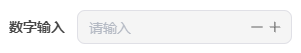

##### 文本输入组件

string 类型，且可选；默认对应文本输入组件，可以被修改为文本区(textarea)输入组件

```sql
fallback: z.string().optional().describe('文本输入')

//修改为文本区(textarea)输入组件
<AutoForm
  inline
  label-placement={'left'}
  schema={schema}
  fieldConfig={{
    fallback: {
      fieldType: 'textarea',
    }
  }}>
</AutoForm>
```

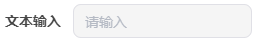

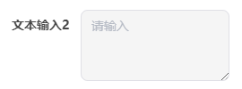

##### 复选框组件，开关组件

boolean 类型，且可选；默认对应复选框组件，可以被修改为开关组件

```sql
checkbox: z.boolean().optional().describe('复选框')

//修改为开关组件
<AutoForm
  inline
  label-placement={'left'}
  schema={schema}
  fieldConfig={{
    checkbox: {
      fieldType: 'switch',
    }
  }}>
</AutoForm>
```


##### 日期选择器组件

date 类型，且可选；默认对应日期选择器

```sql
date: z.coerce.date().optional().describe('日期选择器')
```


##### 选择器组件

enum 类型

```sql
const options = ['option1', 'option2', 'option3'] as const
select: z.enum(options).optional().describe('选择器')
```


##### 单选组件

由于 enum 类型常用于选择器组件使用，但是特殊情况下，也需要将其作为单选组件使用；

```sql
radio: z.enum(options).optional().describe('单选'),

//修改为单选组件
<AutoForm
  inline
  label-placement={'left'}
  schema={schema}
  fieldConfig={{
    radio: {
      fieldType: 'radio',
    }
  }}>
</AutoForm>
```


##### 嵌套组件

有时候需要传递一些嵌套字段，auto-form 同时也支持解析生成

```sql
address: z.object({
    street: z.string(),
    city: z.string(),
    zip: z.string(),
  }),
```


##### nativeEnum

auto-form 在默认情况下，选择器的键值对是 enum 定义时候的键值

```sql
const options = ['option1', 'option2', 'option3'] as const
select: z.enum(options).optional().describe('选择器')
```

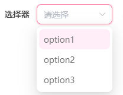

但有时候需要中文的 key，那么就可以使用 nativeEnum 进行定义

```sql
enum Options {
  选项1 = 'option1',
  选项2 = 'option2',
  选项3 = 'option3',
}
select: z.nativeEnum(Options).optional().describe('选择器'),
```

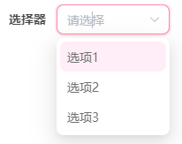

## 类型和接口定义

### 类型定义

1. 以 apifox 中 pero-sdk 项目的 admin/应用管理/应用管理接口为例，这是一个比较典型的 CRUD 接口
   1. 目前所有的 mock 数据都在高级 mock 中，可以自己对分页类型的接口数据专门配置 mock
   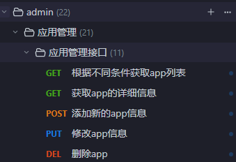

   1. 注意：mock 成功状态的 code 必须为 0
2. 选取 api，复制接口类型

# 参考

- [基于 TanStack Query 的请求状态管理 V2](https://peropero.feishu.cn/wiki/DF53wo6hgiP1j2kMiphc4Qw2nFf?from=from_copylink)
- [基于 TanStack Table 的表格状态管理](https://peropero.feishu.cn/wiki/TgBdwlJkgiHS6Ok87ShccQHpn9e?from=from_copylink)
- [GitHub - vantezzen/auto-form: 🌟  A React component that automatically creates a @shadcn/ui form base](https://github.com/vantezzen/auto-form/tree/main)
